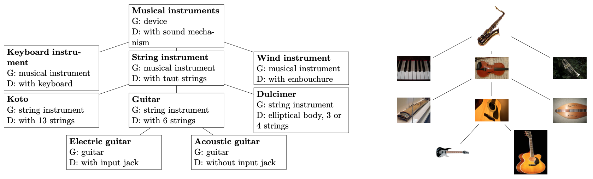

# Continual Hierarchical object recognition




The dataset used in available [here](https://figshare.com/s/e14dd1861c775572eace)

## Installation

Create a conda environment using the environment file and activate it,
you will need to install the module libmr manually due to a bug in that module

```bash
conda env create -f environment.yml
conda activate visualsemantics
```

## How to run the code

### 1. Environment Setup

#### 1.1 Create Conda Virtual Environment

In the project root directory, open a terminal:

```bash
conda env create -f conda-environment.yml
conda activate HOI (your environment name)
```

#### 1.2 Install Additional Dependencies

Ensure the `libmr` library is installed, as it may have compatibility issues:

```bash
pip install libmr==0.1.9
```

---

### 2. Configure the Project (e.g., in PyCharm)

#### 2.1 Import the Project
- Open PyCharm, select `File -> Open`, and choose the project folder.

#### 2.2 Configure Python Interpreter
- Go to `File -> Settings -> Project -> Python Interpreter`
- Click "Add Interpreter" and select the `torch` environment from Conda.

#### 2.3 Configure Run/Debug Configurations
- Go to `Run -> Edit Configurations`.
- Create a new `Bash` or `Python` configuration, specifying the path to `runexp.sh` or the corresponding Python script.

---

### 3. Dataset Preparation

#### 3.1 Download Dataset

`runexp.sh` automatically checks if the dataset exists. If not, it will download it:

```bash
bash runexp.sh
```

This script will:
- Download the dataset `embedded.zip` (from the Figshare link).
- Unzip it to the `dataset/` directory.
- Run the preprocessing script `scripts/fs2desc.py` to generate descriptor files.

#### 3.2 Manual Download (Optional)
- Link: [Dataset on Figshare](https://figshare.com/s/e14dd1861c775572eace)
- Download and extract to the `dataset/` folder.

---

### 4. Run Experiments

#### 4.1 Using Shell Script

Run `runexp.sh` directly:

```bash
bash runexp.sh
```

This script will:
- Download and prepare the dataset.
- Run experiment configurations (stored in the `inputs/` folder).
- Save results in the `results/` folder.
- Generate visualization plots in the `outputs/` folder.

#### 4.2 Run in PyCharm

Right-click on `runexp.sh` or `json_train.py` and select `Run`.

- `runexp.sh`: Automates the entire process.
- `json_train.py`: Run specific experiments manually, for example:

```bash
python scripts/json_train.py --results results/output.npy.lz4 inputs/sample_config.json
```


---

### 5. Project Structure Overview

```plaintext
├── dataset/               # Dataset folder
├── inputs/                # Experiment configuration files (JSON)
├── outputs/               # Visualization results
├── results/               # Experiment result data
├── scripts/               # Core code scripts
│   ├── fs2desc.py         # Dataset descriptor generator
│   ├── json_train.py      # Training script
│   ├── plot_hierarchy.py  # Visualization script
│   ├── pre_embed.py       # Preprocesses datasets to generate embedded feature representations
├── runexp.sh              # Automation script
└── README.md              # Project documentation
```

---

After completing the above steps, you should be able to run the project successfully! 🚀

